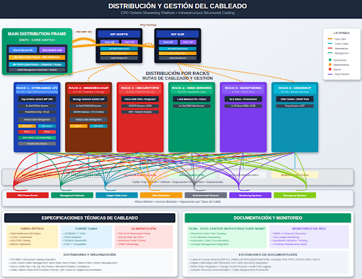
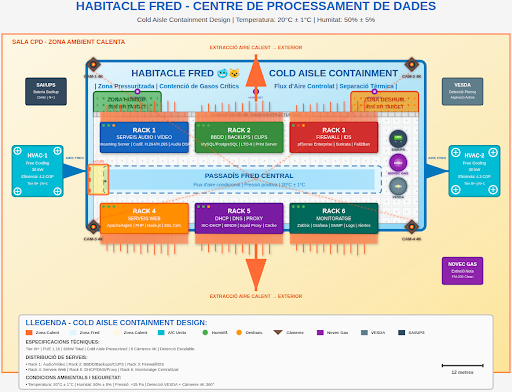
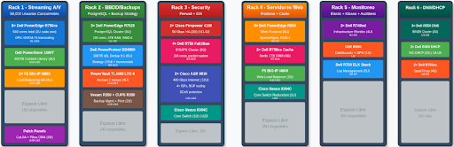

# Documentació del Centre de Processament de Dades (CPD)

## Ubicació Física del CPD en Nau Industrial

L'empresa oferirà serveis d'àudio i streaming a full HD per aproximadament 50.000 clients concurrents. En cas d'expansió de clients a 100.000 o més, els serveis no s'aturaran, ja que el SAI teòricament aguanta una pujada de peticions igual que els nostres servidors.

Per a expansions futures de l'empresa, tenim espai adicional a la nau industrial per a més servidors en cas necessari.

## Ubicació

La ubicació del CPD seria a la unitat industrial del link. Aquesta unitat té una àrea d'aproximadament 400 metres quadrats. La superfície que utilitzarà el CPD serà de 120 metres quadrats, deixant-nos espai lliure per a possibles expansions futures.

Faríem una sala en aquests 400 m² per als 120 que són el nostre disseny, amb parets, sòl i sostre tècnics.

## Climatització

Gràcies al clima fred del Canadà podrem utilitzar free cooling indirecte per a la majoria de la climatització del CPD. També tindrem sistemes d'aire condicionat i humidificadors i deshumidificadors amb controls de temperatura i humitat per pujar o baixar la temperatura en cas de pujada o baixada. I control d'humitat perquè a l'hivern, amb l'aire sec normal del Canadà, poder humidificar la sala en cas necessari o deshumidificar la sala a l'estiu quan l'aire és humit en aquest lloc.

## Cablejat Estructurat

Al nostre CPD Innovate Tech implementem una infraestructura de cablejat estructurat classe empresarial basada en estàndards TIA-568-C amb arquitectura MDF + 2 IDFs (Nord i Sud) que garanteix redundància total N+1 mitjançant Cisco Nexus 9K.

### Infraestructura de Fibra Òptica

El backbone de fibra òptica està compost per fibres OM4, OM5 i OS2, suportant enllaços de fins a 400G amb tecnologia DWDM en topologia d'anell per a màxima resistència:

- **Fibra OM4/OM5 multimode**: Per a enllaços de curta i mitjana distància dins del CPD, optimitzant l'ample de banda entre racks
- **Fibra OS2 monomode**: Per a enllaços de llarga distància i connexions backbone crítiques amb baixa atenuació

### Organització i Connectivitat

La infraestructura compta amb safates portacables de 600mm organitzades en 7 seccions especialitzades (fibra òptica multimode i monomode, coure estructurat, alimentació, gestió, sensors IoT, expansió i emergència), complementades amb terra tècnic subterrani de 600mm.

Utilitzem cablejat de darrera generació que inclou fibra OM4/OM5/OS2 fins a 400G i coure Cat6A/Cat8 fins a 25G amb PoE++ 90W, juntament amb PDUs redundants A+B monitoreats via SNMP.

### Sistema de Gestió

Tot això és gestionat mitjançant un sistema DCIM automatitzat amb seguiment en temps real, etiquetatge RFID, predicció de manteniment i monitoratge IoT continu.

Amb aquest disseny suportem 6 racks amb una càrrega IT de 83 kW, més de 400 ports de connectivitat, redundància completa en tots els nivells crítics i un 50% de capacitat reservada per a escalabilitat futura, aconseguint així una infraestructura Tier-3 amb 99.99% de disponibilitat.

### Parets, Sòl i Sostre

Utilitzarem parets, sòls i sostres tècnics per fer una sala dins de la unitat industrial a prova d'inundacions i utilitzant les parets de llana de vidre i pladur disminueix el risc d'incendis. La llana de vidre estarà al mig de les parets de pladur.

## Disseny

Aquest és el disseny de la sala:

### Estructura dels Racks

Aquesta seria l'estructura dels 6 racks:

## Infraestructura IT

### RACK 1 - STREAMING ÀUDIO/VÍDEO

Aquest rack està optimitzat per streaming d'alt rendiment, amb 8 servidors Dell R750xs dotats de GPUs NVIDIA T4 per a transcodificació en temps real. Cada un ofereix emmagatzematge NVMe en RAID 1, assegurant velocitat i redundància. La biblioteca de continguts s'allotja en una unitat Dell PowerStore de 200TB, sense necessitat de backup per ser contingut recuperable. Dos balancejadors F5 en alta disponibilitat gestionen el tràfic entrant. En conjunt, aquest rack ofereix potència computacional i rendiment de xarxa per a fluxos d'àudio i vídeo exigents.

### RACK 2 - BBDD/BACKUPS/CUPS

Dissenyat per a bases de dades crítiques i emmagatzematge de backups, aquest rack conté un clúster PostgreSQL distribuït sobre tres servidors amb 230TB útils en total. El backup principal es realitza en un sistema PowerProtect amb deduplicació avançada, aconseguint fins a 648TB lògics de retenció local per 2 mesos. També inclou una llibreria LTO-9 per a arxivat a llarg termini, gestionat mitjançant un servidor Veeam dedicat. Un servidor CUPS gestiona impressions per a 500 empleats. Aquest rack és essencial per a la resistència i gestió centralitzada de les dades empresarials.

### RACK 3 - FIREWALL/IDS

Dedicat a la seguretat perimetral i visibilitat de xarxa, aquest rack inclou firewalls Cisco Firepower que protegeixen el tràfic extern amb fins a 50 Gbps. Quatre servidors Dell amb Suricata s'encarreguen de la detecció d'intrusions i anàlisi de paquets. A més, dos routers Cisco ASR ofereixen connectivitat WAN de fins a 400 Gbps, suportant la columna vertebral de la xarxa. Un switch Cisco Nexus tanca el conjunt com a nucli de xarxa. Aquest rack és la primera línia de defensa davant amenaces externes.

### RACK 4 - SERVIDORS WEB

Aquest rack allotja aplicacions web crítiques en sis servidors Dell R650, complementats per dos nodes de caché Redis d'alta memòria que milloren el rendiment de resposta. Un balancejador F5 gestiona les peticions distribuint-les eficientment. Un segon switch core Cisco assegura redundància a nivell de xarxa. Amb baix ús d'espai (13U), aquest rack ofereix escalabilitat i alta disponibilitat per a serveis web.

### RACK 5 - MONITORATGE

El monitoratge centralitzat es gestiona en aquest rack, combinant servidors R740xd per a recol·lecció històrica via Zabbix, un servidor R550 amb visualització Grafana i GPU Quadro, i un node ELK stack per a l'anàlisi de logs. Amb només 7U ocupades, aquest rack concentra eines clau d'observabilitat i anàlisi, garantint control operacional continu i proactiu sobre tota la infraestructura.

### RACK 6 - DNS/DHCP EMPLEATS

Aquest rack suporta serveis essencials de xarxa interna com a resolució DNS, assignació d'adreces IP via DHCP i navegació a través d'un clúster de proxies Squid. Els servidors R550 i R350 asseguren redundància i rapidesa en els serveis DNS/DHCP per a 500 empleats. Els proxies amb 61TB d'emmagatzematge total permeten caching eficient del tràfic web intern. És un rack vital per a l'experiència diària dels usuaris i l'administració de l'entorn LAN.

## Infraestructura Electrica

### Sistema d'Alimentació Ininterrompuda (SAI)

#### SAI PRINCIPAL REDUNDANT

- **Model:** Vertiv Liebert APM 250kVA  
- **Configuració:** 2 unitats (A+B alimentació dual)  
- **Capacitat individual:** 250 kVA / 180 kW per unitat  
- **Temps d'autonomia:** 136 minuts (2.3 hores) a càrrega real  
- **Eficiència:** A++ (96.8% d'eficiència en mode VFI)  
- **Eficiència ECO:** 99.2% (mode de màxima eficiència)  
- **Bateries:** VRLA AGM segellades, vida útil de 10 anys  
- **Monitoratge remot:** SNMP amb targeta Vertiv IntelliSlot  
- **Configuració:** Repartiment de càrrega actiu-actiu  

---

### Càlcul detallat d'autonomia

Amb una càrrega operativa de **98 kW**, el càlcul es fa amb la fórmula següent:

**On:**

- `C`: Capacitat de la bateria (300 Ah per string)  
- `V`: Voltatge de la bateria (480V DC del sistema)  
- `n`: Nombre de strings (2 per SAI = 4 totals)  
- `DoD`: Profunditat de descàrrega (0.8 per VRLA)  
- `P`: Potència consumida (98 kW + pèrdues del SAI)

#### Càlcul pas a pas

- Càrrega DC = `98 ÷ 0.968` = **101.2 kW**  
- Energia disponible per SAI = `480 × 300 × 2 × 0.8` = **230.4 kWh**  
- Energia total = `230.4 × 2` = **460.8 kWh**  
- Autonomia = `460.8 ÷ 101.2` = **4.6 hores**  
- Amb només 1 SAI actiu = `230.4 ÷ 101.2` = **2.3 hores (136 minuts)** ✅

---

### Detall de configuració

Disposem de **2 unitats Vertiv Liebert APM 250kVA** en mode alimentació dual (A+B):

- **Capacitat per unitat:** 250 kVA / 180 kW  
- **Capacitat total:** 500 kVA / 360 kW  
- **Mode operatiu:** Active-Active (repartiment de càrrega)  
- **Eficiència VFI:** 96.8% (A++)  
- **Eficiència ECO:** 99.2%

---

### Sistema de bateries

- **Tipus:** VRLA AGM (Valve Regulated Lead Acid - Absorbed Glass Mat) segellades  
- **Vida útil:** 10 anys @ 20°C  
- **Configuració:** 2 strings per SAI (4 en total)  
- **Voltatge:** 480V DC per string  
- **Capacitat:** 300 Ah @ C10

---

### 1. Càrrega real del sistema

| Component              | Càrrega (kW) |
|------------------------|--------------|
| Càrrega IT (TI)        | 83.0         |
| Climatització          | 25.0         |
| Pèrdues SAI            | 3.2          |
| PDUs + Gestió          | 2.5          |
| Il·luminació LED       | 1.5          |
| Sistemes auxiliars     | 2.0          |
| **Total brut**         | **117.2**    |
| **Total operatiu** (x0.85) | **98.0** |

---

### 2. Escenari 1: Operació normal (2 SAIs actius)

- **Càrrega per SAI:** `98 ÷ 2` = **49 kW**  
- **Energia disponible total:** `480 × 300 × 4 × 0.8` = **460.8 kWh**  
- **Potència DC requerida:** `98 ÷ 0.968` = **101.2 kW**  
- **Autonomia:** `460.8 ÷ 101.2` = **4.55 hores (273 minuts)**

---

### 3. Escenari 2: Mode N+1 (1 SAI en manteniment o fallada)

- **Càrrega total en un sol SAI:** 98 kW  
- **Potència DC:** `98 ÷ 0.968` = **101.2 kW**  
- **Corrent DC:** `101,200 ÷ 480` = **210.8 A**  
- **Corrent per string:** `210.8 ÷ 2` = **105.4 A**  
- **C-rate:** `105.4 ÷ 300` = **0.35C**

**Capacitat efectiva a 0.35C:** 92% → **276 Ah**

- **Energia disponible:** `480 × 276 × 2 × 0.8` = **212.0 kWh**  
- **Autonomia:** `212 ÷ 101.2` = **2.09 hores (125.7 minuts)**

---

### 4. Factors de correcció i consideracions addicionals

**Temperatura ambient:**

| Temperatura | Capacitat |
|-------------|-----------|
| 20°C        | 100%      |
| 25°C        | 98%       |
| 30°C        | 94%       |

A 24°C → Autonomia corregida = `125.7 × 0.98` = **123.2 minuts**

**Envelliment de bateries:**

| Anys | Capacitat |
|------|-----------|
| 1-3  | 100%      |
| 4-6  | 90%       |
| 7-9  | 80%       |
| 10   | 70% (substitució recomanada) |

**Eficiència segons càrrega:**

| % Càrrega | Eficiència |
|-----------|------------|
| 25%       | 94%        |
| 50%       | 96%        |
| 75%       | 96.8%      |
| 100%      | 96.5%      |

---

### 5. Resum de temps d’autonomia

| Escenari    | Càrrega total | SAIs actius | Càrrega/SAI | Autonomia         |
|-------------|----------------|-------------|--------------|--------------------|
| Normal      | 98 kW          | 2           | 49 kW        | 273 min (4.5 h)    |
| Mode N+1    | 98 kW          | 1           | 98 kW        | 136 min (2.3 h)    |
| Emergència* | 65 kW          | 1           | 65 kW        | 195 min (3.2 h)    |

## Seguretat Física

Aplicarem mesures de control d'accés a la sala del CPD utilitzant un dispositiu que va per empremta i data, registrant qui entra a la sala i a quina hora i dia entra, tenint un registre complet de qui entra i qui no. A més, gràcies als serveis de videovigilància que ofereixen les nostres càmeres de seguretat dins de la sala, també podrem veure què fa aquesta persona dins de la sala.

### Prevenció d'Incendis

Per a les mesures de prevenció d'incendis amb les nostres parets de llana de vidre i pladur teòricament prevenen bastant bé els incendis, ja que les parets serien ignífugues.

#### Detecció

Per a la detecció utilitzarem un sistema VESDA de detecció de fum per aspiració. Aquests sistemes treballen a través de tubs instal·lats a la sala, aspirant l'aire i passant-lo per un detector làser d'alta sensibilitat per detectar partícules de combustió. Quan es detecta una partícula s'activa una alerta.

Instal·larem:
- **VESDA-E VEU** per a la sala en general
- **VESDA-E VEA** per tenir un sistema de detecció també a l'interior dels racks

Els tubs s'instal·laran o bé al sòl o sostre tècnic.

#### Extinció

En cas que es detecti un incendi tindrem instal·lats sistemes d'extinció d'incendis per gas Novec 1230. Aquest sistema funciona de tal forma que extreu l'oxigen de la sala per extingir el foc, sense perill al medi ambient i a un nivell segur per a les persones (en cas que just es produeixi l'incendi quan hi hagi algú dins del CPD).

#### Evacuació

Per a possibles evacuacions hi haurà una senyalització fotoluminescent de rutes d'evacuació.

## Seguretat Lògica

### Accés al Sistema

Per accedir dins dels sistemes del CPD es farà amb un usuari administrador específic amb una contrasenya. S'utilitzarà **Argon2id** per a la seguretat de les contrasenyes.

### Detecció d'Intrusos

Sistema de detecció d'intrusos (que estarà al servidor de seguretat) que en el nostre cas utilitzarem **Fail2Ban** per la seva facilitat i eficiència. En cas d'intrusió s'avisaria per un Discord d'empresa específic per als logs d'intrusió. A més, gràcies a aquest servei, si es detecta un atac DDoS o de l'estil automàticament bloqueja la IP.

### Servidor de Seguretat

Hi haurà un servidor específic de seguretat que tindrà dins un firewall i que cada servidor dins del CPD passa primer per aquest servidor de seguretat. El firewall que el servidor de seguretat tindrà, vindrà amb unes regles restrictives (encara per definir).

### Monitorització

Utilitzarem **Elasticsearch + Kibana + Auditbeat** per a la monitorització, que estarà tot configurat dins d'un servidor específic per a la monitorització.

### Estratègia de Backups

La estratègia de backups consistirà en:

- **Còpia completa**: dies 1, 10 i 20
- **Còpies incrementals**: els altres dies
  - Còpia incremental del 2 al 9 a partir de la còpia completa del dia 1
  - Còpia incremental del 11 al 19 a partir de la còpia completa del dia 10
  - Còpia incremental del 21 al 30 a partir de la còpia completa del dia 20

#### Retenció

- **Local**: Les còpies incrementals i les completes es guardaran en local durant 2 mesos (cada 2 mesos s'esborraran)
- **Núvol**: Utilitzant programes com **deja-dup** es podria configurar per fer aquestes còpies i guardar-les en un drive al núvol. Si es fa, aquestes còpies es podrien guardar durant 6-12 mesos per a retenció davant desastres/històrics.

### Sistema RAID

- **Servidor BBDD i backups**: Utilitzarem un **RAID-6** en lloc d'un RAID-5, perquè encara que sigui menys econòmic, el RAID-6 és més segur
- **Altres servidors**: Simplement apliquem un **RAID-1**
